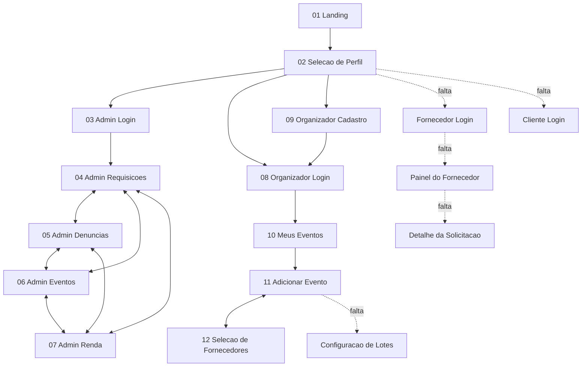

# Mapa de Fluxo do Protótipo Navegável - TrocaTicket

Documento de apoio para a montagem do protótipo navegável no Figma. Lista as telas existentes, as ligações que devem ser criadas entre elas e as telas que ainda faltam para fechar os fluxos dos três módulos principais.

## 1. Telas existentes

Descontadas as duplicatas de tema claro e escuro, existem 12 telas únicas.

| # | Nome sugerido do frame | Módulo | Origem no Stitch |
|---|---|---|---|
| 01 | 01 - Landing | Público | trocaticket_p_gina_principal |
| 02 | 02 - Selecao de Perfil | Público | trocaticket_logins |
| 03 | 03 - Admin - Login | Administrador | trocaticket_login_do_administrador |
| 04 | 04 - Admin - Requisicoes de Cadastro | Administrador | trocaticket_home_administrador_requisi_es_de_cadastros |
| 05 | 05 - Admin - Denuncias | Administrador | trocaticket_home_administrador_den_ncias |
| 06 | 06 - Admin - Eventos | Administrador | trocaticket_home_administrador_eventos |
| 07 | 07 - Admin - Renda | Administrador | trocaticket_home_administrador_renda |
| 08 | 08 - Organizador - Login | Organizador | login_do_organizador_trocaticket |
| 09 | 09 - Organizador - Cadastro | Organizador | cadastro_do_organizador_trocaticket |
| 10 | 10 - Organizador - Meus Eventos | Organizador | painel_do_organizador_meus_eventos |
| 11 | 11 - Organizador - Adicionar Evento | Organizador | painel_do_organizador_adicionar_eventos |
| 12 | 12 - Organizador - Selecao de Fornecedores | Organizador | sele_o_de_fornecedores_credenciados |

Recomendação: escolher **apenas um tema** para o protótipo, de preferência o claro, e tratar o tema escuro como variação visual documentada. Montar os dois dobra o trabalho de ligação sem acrescentar nada ao fluxo.

## 2. Visão geral do fluxo

## 3. Ligações a criar no Figma

Cada linha abaixo é uma conexão. O tipo indica o que escolher no painel Prototype do Figma.

### 3.1 Fluxo público

| Tela de origem | Elemento clicável | Destino | Tipo |
|---|---|---|---|
| 01 Landing | Entrar (topo) | 02 Selecao de Perfil | Navigate to |
| 01 Landing | Criar Conta | 02 Selecao de Perfil | Navigate to |
| 01 Landing | Criar Conta Gratuita (rodapé) | 02 Selecao de Perfil | Navigate to |
| 01 Landing | Como Funciona, Segurança, Parceiros, Avaliações | seção correspondente | Scroll to |
| 02 Selecao de Perfil | Voltar para o início | 01 Landing | Navigate to |
| 02 Selecao de Perfil | Portal do Organizador | 08 Organizador Login | Navigate to |
| 02 Selecao de Perfil | Cadastrar evento / produtora | 09 Organizador Cadastro | Navigate to |
| 02 Selecao de Perfil | Acesso Restrito Admin | 03 Admin Login | Navigate to |
| 02 Selecao de Perfil | Acessar como Fornecedor | tela que falta | pendente |
| 02 Selecao de Perfil | Acessar como Cliente | tela que falta | pendente |

### 3.2 Módulo Administrador

| Tela de origem | Elemento clicável | Destino | Tipo |
|---|---|---|---|
| 03 Admin Login | Autenticar no Painel Master | 04 Admin Requisicoes | Navigate to |
| 03 Admin Login | seta de voltar | 02 Selecao de Perfil | Navigate to |
| 04, 05, 06, 07 | item Denúncias do menu | 05 Admin Denuncias | Navigate to |
| 04, 05, 06, 07 | item Renda do menu | 07 Admin Renda | Navigate to |
| 04, 05, 06, 07 | item Eventos do menu | 06 Admin Eventos | Navigate to |
| 04, 05, 06, 07 | item Requisições de Cadastros do menu | 04 Admin Requisicoes | Navigate to |
| 04, 05, 06, 07 | ícone de logout | 02 Selecao de Perfil | Navigate to |
| 04 Admin Requisicoes | Aceitar e Homologar Cadastro | overlay de confirmação | Open overlay |
| 04 Admin Requisicoes | Negar Cadastro | overlay com campo de motivo | Open overlay |
| 04 Admin Requisicoes | Visualizar Dossiê & Documentos | tela que falta | pendente |
| 05 Admin Denuncias | Ver detalhes da denúncia | tela que falta | pendente |
| 05 Admin Denuncias | Congelar Usuário | overlay de confirmação | Open overlay |
| 05 Admin Denuncias | abas Todas, Fraude, Cobrança, Golpe | a própria tela | Navigate to (self) |
| 06 Admin Eventos | Gerenciar Lotes & Regras | tela que falta | pendente |
| 06 Admin Eventos | Pausar Revendas | overlay de confirmação | Open overlay |
| 07 Admin Renda | Exportar Balanço | overlay de exportação | Open overlay |
| 07 Admin Renda | filtros 1M, 3M, 6M, 1A | a própria tela | Navigate to (self) |

O menu superior aparece igual nas quatro telas do administrador. Vale transformá-lo em **componente** no Figma antes de ligar, porque assim você cria as ligações uma vez só em vez de quatro.

### 3.3 Módulo Organizador

| Tela de origem | Elemento clicável | Destino | Tipo |
|---|---|---|---|
| 08 Organizador Login | Entrar no Painel | 10 Meus Eventos | Navigate to |
| 08 Organizador Login | Cadastre-se | 09 Organizador Cadastro | Navigate to |
| 09 Organizador Cadastro | Voltar para o Login | 08 Organizador Login | Navigate to |
| 09 Organizador Cadastro | Enviar Cadastro para Análise | overlay de cadastro em análise | Open overlay |
| overlay de cadastro em análise | botão de fechar | 08 Organizador Login | Navigate to |
| 10 Meus Eventos | Adicionar Eventos (menu) | 11 Adicionar Evento | Navigate to |
| 10 Meus Eventos | Adicionar Novo Evento | 11 Adicionar Evento | Navigate to |
| 10 Meus Eventos | Meus Eventos (menu) | a própria tela | Navigate to (self) |
| 10 Meus Eventos | logout | 08 Organizador Login | Navigate to |
| 10 Meus Eventos | Ver Detalhes do Evento | tela que falta | pendente |
| 11 Adicionar Evento | Usar Credenciado TrocaTicket (bloco de segurança) | 12 Selecao de Fornecedores | Navigate to |
| 11 Adicionar Evento | Alterar para outro espaço credenciado | 12 Selecao de Fornecedores | Navigate to |
| 11 Adicionar Evento | Voltar para Meus Eventos | 10 Meus Eventos | Navigate to |
| 11 Adicionar Evento | Salvar Rascunho | overlay de rascunho salvo | Open overlay |
| 11 Adicionar Evento | Avançar para Configuração de Lotes | tela que falta | pendente |
| 12 Selecao de Fornecedores | Selecionar este Fornecedor | a própria tela, cartão em estado selecionado | Navigate to (self) |
| 12 Selecao de Fornecedores | Confirmar e Vincular ao Evento | 11 Adicionar Evento | Navigate to |
| 12 Selecao de Fornecedores | Cancelar / Manter Próprio | 11 Adicionar Evento | Navigate to |

## 4. Lacunas do protótipo

### 4.1 Crítica: o módulo Fornecedor não existe

O enunciado pede os fluxos dos módulos Administrador, Organizador **e Fornecedor**. Hoje o fornecedor só aparece visto de fora, ou seja, pela tela em que o organizador escolhe entre empresas credenciadas. Não existe nenhuma tela em que o próprio fornecedor entre no sistema e faça alguma coisa.

Telas mínimas para fechar esse módulo:

| Tela | Conteúdo | Ligações |
|---|---|---|
| Fornecedor - Login | E-mail, senha, botão de entrar, link para credenciamento | Selecao de Perfil para cá, daqui para o Painel |
| Fornecedor - Credenciamento | Razão social, CNPJ, tipo de serviço, certidões, envio para análise | Login para cá, daqui volta para o Login |
| Fornecedor - Painel de Solicitações | Lista de contratações recebidas com status solicitado, aceito, recusado e concluído | Login para cá, cada item leva ao detalhe |
| Fornecedor - Detalhe da Solicitação | Dados do evento, serviço pedido, valor, botões de aceitar e recusar | Painel para cá, aceitar e recusar abrem overlay e voltam para o Painel |

Essas quatro telas correspondem exatamente à tabela `contratacao` da modelagem do banco, o que deixa protótipo e banco de dados coerentes entre si.

### 4.2 Overlays que faltam

São telas pequenas, de confirmação, que dão sensação de sistema real. Cada uma é um frame pequeno usado com Open overlay.

- Confirmação de homologação de cadastro, no módulo administrador
- Recusa de cadastro com campo de motivo, no módulo administrador
- Confirmação de congelamento de usuário, no módulo administrador
- Cadastro enviado para análise, no módulo organizador
- Rascunho salvo, no módulo organizador

### 4.3 Telas de detalhe que faltam

Podem ficar de fora se o tempo apertar, já que os fluxos principais fecham sem elas.

- Detalhe da denúncia
- Dossiê do cadastro em análise
- Detalhe do evento, na visão do organizador
- Configuração de lotes e ingressos

## 5. Ordem sugerida de montagem

1. Importar as 12 telas existentes como frames e nomear conforme a tabela da seção 1.
2. Transformar o menu do administrador em componente e ligar as quatro abas entre si.
3. Montar o fluxo do organizador, do login até a seleção de fornecedores, que é o mais longo e o mais demonstrável.
4. Gerar no Stitch as quatro telas do módulo fornecedor e ligá-las.
5. Criar os cinco overlays de confirmação.
6. Testar no modo Present percorrendo os três módulos de ponta a ponta.
7. Publicar o link com permissão para qualquer pessoa e colocar no README do projeto.
